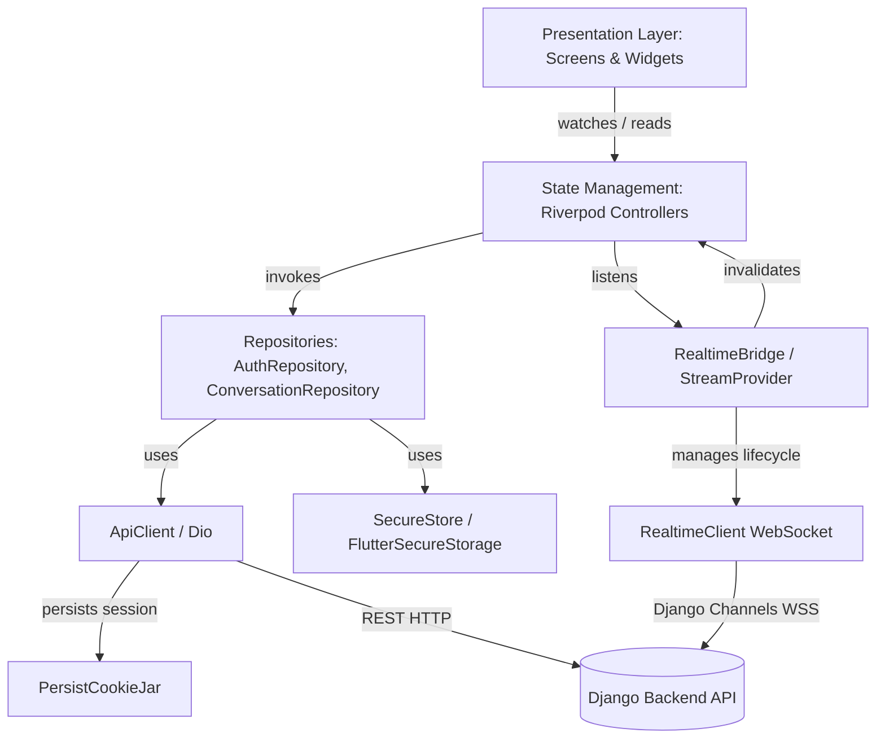
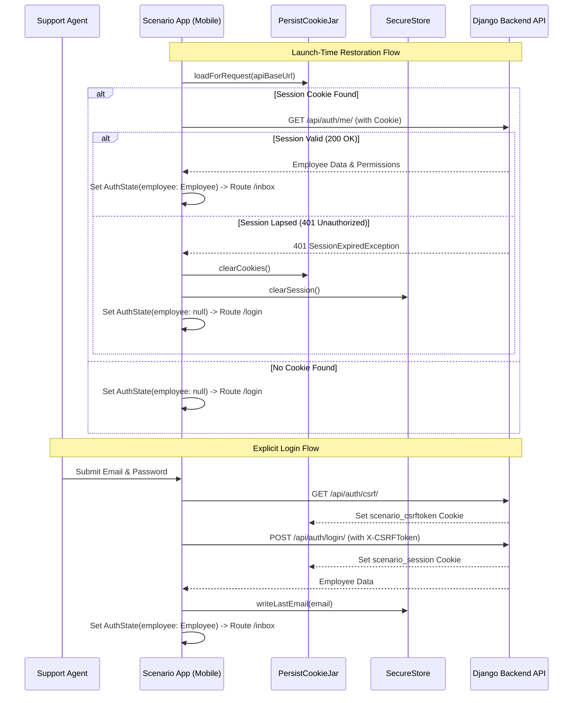
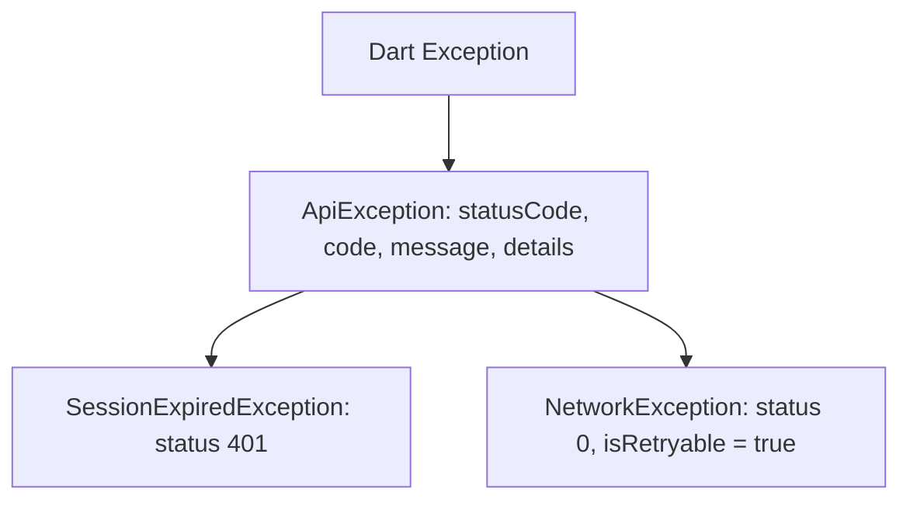

# CODEBASE AUDIT REPORT: SCENARIO MOBILE APP (`scenario_mobile`)

**Audit Type:** Complete Read-Only Technical Architecture & Codebase Audit  
**Target Repository:** `ScenarioMobileApp` / `scenario_mobile`  
**Framework & Language:** Flutter (Dart SDK `^3.12.0`)  
**State Management:** Riverpod `^3.0.3` (`AsyncNotifier`, `Notifier`, `Provider`, `StreamProvider`)  
**Network & Realtime:** Dio `^5.9.0` with `PersistCookieJar` & CSRF Interceptor; Django Channels WebSockets (`web_socket_channel ^3.0.3`)  
**Audit Date:** August 10, 2026  

---

## 1. Executive Summary

`scenario_mobile` is an enterprise-grade Flutter mobile application built for customer support agents and team supervisors. It serves as a mobile-native front-end client for an existing multi-tenant omnichannel customer service platform backend (built with Python/Django & Django Channels).

### Core Highlights & Architectural Principles:
1. **Server-Authoritative Design:** No business rules, visibility filters, or access control rules are duplicated on the mobile client. Authorization, routing logic, agent capacity, and communication channel constraints are strictly decided by the backend. The mobile client presents what the backend returns and handles HTTP 403 / 401 exceptions gracefully.
2. **Web-Compatible Authentication Strategy:** Rather than implementing a second OAuth/Bearer token mechanism for mobile, the app reuses the web platform's session cookie (`scenario_session`) and CSRF token (`scenario_csrftoken`) strategy via `dio_cookie_manager` and `PersistCookieJar`.
3. **Signal-Based Realtime Updates:** WebSocket events (`message.created`, `conversation.assigned`, etc.) act exclusively as *invalidation signals* rather than state patches. Upon receiving a WebSocket event, the application marks local Riverpod providers stale and refetches from the authoritative REST API (TanStack Query pattern).
4. **Mobile-Native UI Adaptation:** Converts the desktop client's three-column layout (Inbox | Conversation | Customer Details) into a responsive, push-based single-column navigation stack using `GoRouter`.

---

## 2. Project Structure

The project follows a hybrid **Feature-First + Layered Core** architecture under `lib/`.

```
lib/
├── app/
│   └── router.dart                 # GoRouter configuration & Auth Guard
├── core/
│   ├── api/
│   │   ├── api_client.dart          # Dio wrapper, CookieJar & CSRF interceptor
│   │   └── api_exception.dart       # Typed exception hierarchy (ApiException, SessionExpiredException, NetworkException)
│   ├── auth/
│   │   └── auth_repository.dart     # Authentication REST endpoints & session persistence
│   ├── config/
│   │   └── environment.dart        # Environment configuration (--dart-define)
│   ├── models/
│   │   ├── conversation.dart       # Conversation, CustomerBrief, TeamBrief, IntelligenceBrief, Paginated<T>
│   │   ├── employee.dart           # Employee, EmployeeBrief, Organization, Perm permission constants
│   │   └── message.dart            # Message, MessageAttachment, InternalNote, SendState enum
│   ├── providers.dart              # Core Riverpod providers & DI overrides
│   ├── realtime/
│   │   ├── realtime_bridge.dart    # App lifecycle & socket event -> cache invalidation bridge
│   │   └── realtime_client.dart    # Django Channels WebSocket client with auto-reconnect & heartbeat
│   ├── storage/
│   │   └── secure_store.dart       # FlutterSecureStorage wrapper (Keychain / EncryptedSharedPreferences)
│   ├── theme/
│   │   ├── app_theme.dart          # Material 3 ThemeData with explicit web token mappings
│   │   └── tokens.dart             # ScenarioColors (HSL), Space, Radii constants
│   ├── utils/
│   │   └── formatting.dart         # Relative time, DateFormat, enum humanization
│   └── widgets/
│       ├── avatar.dart             # InitialsAvatar with channel provider glyph & PresenceDot
│       ├── badges.dart             # StatusBadge, ConversationBadges mappings
│       └── states.dart             # LoadingState, EmptyState, ErrorStateView, InlineError, ConversationSkeleton
└── features/
    ├── authentication/
    │   ├── auth_controller.dart    # AuthState & AuthController (session lifecycle)
    │   └── login_screen.dart       # Login Form view
    ├── conversations/
    │   ├── conversation_repository.dart # REST calls for conversation lists, details, assignments, status
    │   ├── inbox_controller.dart   # Paginated InboxState & InboxFiltersController
    │   ├── inbox_filters_sheet.dart# Bottom sheet filter UI
    │   └── inbox_screen.dart       # Main Inbox list view with infinite scroll & search
    ├── customers/
    │   └── customer_details_screen.dart # Pushed customer metadata & intelligence panel
    ├── messages/
    │   ├── conversation_actions_sheet.dart # Action sheet for assignment, status, priority updates
    │   ├── conversation_controller.dart # Thread state, optimistic send, retry logic
    │   ├── conversation_screen.dart # Chat message list & reply composer view
    │   └── message_bubble.dart     # MessageBubble, DeliveryIcon, FailureActions & attachments
    └── profile/
        └── profile_screen.dart     # Employee profile & availability status toggle
```

---

## 3. Architecture

### Dependency & Data Direction Diagram



### Architectural Principles Audit:
- **Presentation Layer:** Pure Flutter widgets (`ConsumerWidget` / `ConsumerStatefulWidget`). Presentation logic delegates immediately to Riverpod providers.
- **Domain & State Layer:** Encapsulated in controllers (`InboxController`, `ConversationController`, `AuthController`) extending Riverpod's `AsyncNotifier` or `Notifier`.
- **Data Layer:** Isolated in repositories (`AuthRepository`, `ConversationRepository`) consuming `ApiClient` and `SecureStore`.
- **Architectural Integrity:** Clean layer separation is maintained. No Dio or raw HTTP calls exist inside UI widgets.

---

## 4. Features

| Feature Module | Key Responsibilities | Primary Source Directory |
| :--- | :--- | :--- |
| **Authentication** | Login, launch-time session restoration, automatic 401 handling, logout, local email pre-fill. | `lib/features/authentication/` |
| **Inbox & Conversations** | Infinite-scrolling conversation list, status/priority/channel filtering, search, count badges, pulls-to-refresh. | `lib/features/conversations/` |
| **Message Thread** | Chat bubble rendering, message history pagination, optimistic send with local pending ID, failed send retry/discard. | `lib/features/messages/` |
| **Conversation Actions** | Self-assignment, team/employee assignment, status transitions, priority updates. | `lib/features/messages/conversation_actions_sheet.dart` |
| **Customer Intelligence** | Pushed metadata panel displaying customer lifecycle, lead score, purchase status, and review flags. | `lib/features/customers/` |
| **Agent Profile & Presence** | View agent details, organization info, and toggle presence (`ONLINE`, `AWAY`, `BREAK`, `OFFLINE`). | `lib/features/profile/` |
| **Realtime Sync** | Automatic socket lifecycle management on app foreground/background; cache invalidations. | `lib/core/realtime/` |

---

## 5. Complete Screen Inventory

| Screen / Component | Source File | Route | Parameters | State Provider | API Interactions | Key User Actions |
| :--- | :--- | :--- | :--- | :--- | :--- | :--- |
| **LoginScreen** | [login_screen.dart](file:///c:/Users/SOFT%20LAPTOP/StudioProjects/SocialOmniChannelMobileApp/lib/features/authentication/login_screen.dart) | `/login` | `next` (query) | `authControllerProvider` | `POST /auth/login/`, `GET /auth/csrf/` | Enter credentials, Submit login form, Toggle password visibility |
| **InboxScreen** | [inbox_screen.dart](file:///c:/Users/SOFT%20LAPTOP/StudioProjects/SocialOmniChannelMobileApp/lib/features/conversations/inbox_screen.dart) | `/inbox` | None | `inboxControllerProvider`, `inboxFiltersProvider` | `GET /conversations/`, `GET /conversations/counts/` | Pull-to-refresh, Infinite scroll, Search conversations, Open filters sheet, Navigate to conversation |
| **InboxFiltersSheet** | [inbox_filters_sheet.dart](file:///c:/Users/SOFT%20LAPTOP/StudioProjects/SocialOmniChannelMobileApp/lib/features/conversations/inbox_filters_sheet.dart) | Modal Sheet | None | `inboxFiltersProvider` | None (Updates state filter query) | Select status/priority/channel chips, Toggle "Assigned to me"/"Unassigned", Clear filters |
| **ConversationScreen** | [conversation_screen.dart](file:///c:/Users/SOFT%20LAPTOP/StudioProjects/SocialOmniChannelMobileApp/lib/features/messages/conversation_screen.dart) | `/inbox/:id` | `id` (path) | `conversationControllerProvider(id)` | `GET /conversations/:id/`, `GET /conversations/:id/messages/`, `POST /conversations/:id/reply/`, `POST /conversations/:id/read/` | Send reply, Retry failed message, Discard failed message, Load older history on top scroll, Open actions sheet, Open customer details |
| **ConversationActionsSheet** | [conversation_actions_sheet.dart](file:///c:/Users/SOFT%20LAPTOP/StudioProjects/SocialOmniChannelMobileApp/lib/features/messages/conversation_actions_sheet.dart) | Modal Sheet | `conversationId` | `conversationControllerProvider(id)` | `POST /conversations/:id/assign/`, `POST /conversations/:id/status/`, `POST /conversations/:id/priority/` | Self-assign, Unassign, Change status, Change priority |
| **CustomerDetailsScreen** | [customer_details_screen.dart](file:///c:/Users/SOFT%20LAPTOP/StudioProjects/SocialOmniChannelMobileApp/lib/features/customers/customer_details_screen.dart) | `/inbox/:id/customer` | `id` (path) | `conversationControllerProvider(id)` | Uses cached conversation detail | View customer metadata, channel details, lead score, and intelligence flags |
| **ProfileScreen** | [profile_screen.dart](file:///c:/Users/SOFT%20LAPTOP/StudioProjects/SocialOmniChannelMobileApp/lib/features/profile/profile_screen.dart) | `/profile` | None | `authControllerProvider` | `POST /auth/availability/`, `POST /auth/logout/` | Toggle availability (`ONLINE`/`AWAY`/`BREAK`/`OFFLINE`), Sign out with confirmation |

---

## 6. Navigation Audit

Navigation is implemented using `GoRouter` (v17.2.1) in [router.dart](file:///c:/Users/SOFT%20LAPTOP/StudioProjects/SocialOmniChannelMobileApp/lib/app/router.dart).

```mermaid
graph TD
    AppLaunch([App Launch / Splash]) --> CheckAuth{Auth State?}
    CheckAuth -->|Restoring| Splash[Loading Splash]
    CheckAuth -->|Offline Error| Offline[Offline Retry Screen]
    CheckAuth -->|Unauthenticated| Login[/login]
    CheckAuth -->|Authenticated| Inbox[/inbox]
    
    Login -->|Successful Sign-in| RestoreTarget{Has next parameter?}
    RestoreTarget -->|Yes| TargetRoute[Deep Link Route]
    RestoreTarget -->|No| Inbox
    
    Inbox -->|Tap Conversation| Conversation[/inbox/:id]
    Inbox -->|Tap Profile Avatar| Profile[/profile]
    Inbox -->|Tap Filter Icon| FiltersSheet[Bottom Sheet: Filters]
    
    Conversation -->|Tap Customer Icon| Customer[/inbox/:id/customer]
    Conversation -->|Tap Actions Icon| ActionsSheet[Bottom Sheet: Actions]
    
    Profile -->|Sign Out| Login
```

### Route Table

| Route Pattern | Screen Widget | Dynamic Parameters | Guard Condition | Target / Redirect Destination |
| :--- | :--- | :--- | :--- | :--- |
| `/login` | `LoginScreen` | Query: `next` | If already authenticated -> Redirects to `next` or `/inbox` | `/inbox` |
| `/inbox` | `InboxScreen` | Query: `status`, `priority`, `provider`, `search` | Requires Authentication | `/login?next=%2Finbox` |
| `/inbox/:id` | `ConversationScreen` | Path: `id` (int) | Requires Authentication | `/login?next=%2Finbox%2F:id` |
| `/inbox/:id/customer` | `CustomerDetailsScreen` | Path: `id` (int) | Requires Authentication | `/login?next=%2Finbox%2F:id%2Fcustomer` |
| `/profile` | `ProfileScreen` | None | Requires Authentication | `/login?next=%2Fprofile` |
| `*` (Error) | `_InvalidRoute` | None | None | Offers button back to `/inbox` |

---

## 7. API / Backend Audit

All backend interactions are executed via `ApiClient` ([api_client.dart](file:///c:/Users/SOFT%20LAPTOP/StudioProjects/SocialOmniChannelMobileApp/lib/core/api/api_client.dart)) configured with a base URL dynamically generated from `Environment.current.apiBaseUrl`.

### Endpoints Inventory Table

| HTTP Method | Full Endpoint Path | Auth Req. | Headers Passed | Request Body / Query Params | Response Structure | Triggering Feature / Service | Source File |
| :--- | :--- | :--- | :--- | :--- | :--- | :--- | :--- |
| `GET` | `/api/auth/csrf/` | Optional | `User-Agent`, `ngrok-skip-browser-warning` | None | Cookie: `scenario_csrftoken` | AuthRepository.login() | [auth_repository.dart](file:///c:/Users/SOFT%20LAPTOP/StudioProjects/SocialOmniChannelMobileApp/lib/core/auth/auth_repository.dart#L29) |
| `POST` | `/api/auth/login/` | No | `X-CSRFToken`, `Referer` | `{"email": "...", "password": "..."}` | `{"employee": {...}}` | AuthRepository.login() | [auth_repository.dart](file:///c:/Users/SOFT%20LAPTOP/StudioProjects/SocialOmniChannelMobileApp/lib/core/auth/auth_repository.dart#L31) |
| `GET` | `/api/auth/me/` | Session | `Cookie` | None | `Employee` JSON object | AuthRepository.restore(), currentEmployee() | [auth_repository.dart](file:///c:/Users/SOFT%20LAPTOP/StudioProjects/SocialOmniChannelMobileApp/lib/core/auth/auth_repository.dart#L52) |
| `POST` | `/api/auth/logout/` | Session | `X-CSRFToken`, `Cookie` | None | `{}` | AuthRepository.logout() | [auth_repository.dart](file:///c:/Users/SOFT%20LAPTOP/StudioProjects/SocialOmniChannelMobileApp/lib/core/auth/auth_repository.dart#L71) |
| `POST` | `/api/auth/availability/` | Session | `X-CSRFToken`, `Cookie` | `{"availability": "ONLINE"}` | `{}` | AuthRepository.setAvailability() | [auth_repository.dart](file:///c:/Users/SOFT%20LAPTOP/StudioProjects/SocialOmniChannelMobileApp/lib/core/auth/auth_repository.dart#L81) |
| `GET` | `/api/conversations/` | Session | `Cookie` | Query: `page`, `status`, `priority`, `provider`, `search`, `assigned_to`, `assigned_to__isnull` | `Paginated<Conversation>` envelope | ConversationRepository.list() | [conversation_repository.dart](file:///c:/Users/SOFT%20LAPTOP/StudioProjects/SocialOmniChannelMobileApp/lib/features/conversations/conversation_repository.dart#L78) |
| `GET` | `/api/conversations/:id/` | Session | `Cookie` | Path parameter: `id` | `Conversation` JSON object | ConversationRepository.detail() | [conversation_repository.dart](file:///c:/Users/SOFT%20LAPTOP/StudioProjects/SocialOmniChannelMobileApp/lib/features/conversations/conversation_repository.dart#L90) |
| `GET` | `/api/conversations/counts/` | Session | `Cookie` | None | `{"open": 5, "unassigned": 2, ...}` | ConversationRepository.counts() | [conversation_repository.dart](file:///c:/Users/SOFT%20LAPTOP/StudioProjects/SocialOmniChannelMobileApp/lib/features/conversations/conversation_repository.dart#L95) |
| `GET` | `/api/conversations/:id/messages/` | Session | `Cookie` | Query: `page` | `Paginated<Message>` envelope | ConversationRepository.messages() | [conversation_repository.dart](file:///c:/Users/SOFT%20LAPTOP/StudioProjects/SocialOmniChannelMobileApp/lib/features/conversations/conversation_repository.dart#L100) |
| `POST` | `/api/conversations/:id/reply/` | Session | `X-CSRFToken`, `Cookie` | `{"text": "..."}` | `Message` JSON object | ConversationRepository.reply() | [conversation_repository.dart](file:///c:/Users/SOFT%20LAPTOP/StudioProjects/SocialOmniChannelMobileApp/lib/features/conversations/conversation_repository.dart#L113) |
| `POST` | `/api/conversations/:id/read/` | Session | `X-CSRFToken`, `Cookie` | None | `{}` | ConversationRepository.markRead() | [conversation_repository.dart](file:///c:/Users/SOFT%20LAPTOP/StudioProjects/SocialOmniChannelMobileApp/lib/features/conversations/conversation_repository.dart#L121) |
| `POST` | `/api/conversations/:id/assign/` | Session | `X-CSRFToken`, `Cookie` | `{"assignee_id": ?, "team_id": ?, "note": ?}` | `{}` | ConversationRepository.assign() | [conversation_repository.dart](file:///c:/Users/SOFT%20LAPTOP/StudioProjects/SocialOmniChannelMobileApp/lib/features/conversations/conversation_repository.dart#L125) |
| `POST` | `/api/conversations/:id/status/` | Session | `X-CSRFToken`, `Cookie` | `{"status": "..."}` | `{}` | ConversationRepository.changeStatus() | [conversation_repository.dart](file:///c:/Users/SOFT%20LAPTOP/StudioProjects/SocialOmniChannelMobileApp/lib/features/conversations/conversation_repository.dart#L143) |
| `POST` | `/api/conversations/:id/priority/` | Session | `X-CSRFToken`, `Cookie` | `{"priority": "..."}` | `{}` | ConversationRepository.changePriority() | [conversation_repository.dart](file:///c:/Users/SOFT%20LAPTOP/StudioProjects/SocialOmniChannelMobileApp/lib/features/conversations/conversation_repository.dart#L149) |
| `POST` | `/api/conversations/:id/category/` | Session | `X-CSRFToken`, `Cookie` | `{"category_id": ?}` | `{}` | ConversationRepository.changeCategory() | [conversation_repository.dart](file:///c:/Users/SOFT%20LAPTOP/StudioProjects/SocialOmniChannelMobileApp/lib/features/conversations/conversation_repository.dart#L155) |
| `GET` | `/api/conversations/:id/notes/` | Session | `Cookie` | Path parameter: `id` | `[InternalNote]` array | ConversationRepository.notes() | [conversation_repository.dart](file:///c:/Users/SOFT%20LAPTOP/StudioProjects/SocialOmniChannelMobileApp/lib/features/conversations/conversation_repository.dart#L161) |
| `POST` | `/api/conversations/:id/notes/` | Session | `X-CSRFToken`, `Cookie` | `{"body": "..."}` | `InternalNote` JSON object | ConversationRepository.addNote() | [conversation_repository.dart](file:///c:/Users/SOFT%20LAPTOP/StudioProjects/SocialOmniChannelMobileApp/lib/features/conversations/conversation_repository.dart#L169) |
| `WSS` | `/ws/inbox/` | Session Cookie | `Cookie`, `User-Agent` | `{action: "subscribe"|"unsubscribe"|"ping"}` | `{event: "...", payload: {...}}` | `RealtimeClient` | [realtime_client.dart](file:///c:/Users/SOFT%20LAPTOP/StudioProjects/SocialOmniChannelMobileApp/lib/core/realtime/realtime_client.dart#L117) |

---

## 8. Authentication & Authorization



### Roles & Permissions:
- Permission slugs (`Perm.conversationReply`, `Perm.conversationAssignSelf`, etc.) are returned in `/auth/me/` response as a `Set<String>`.
- `canProvider(permission)` helper evaluates whether the current employee holds the slug to conditionally render UI controls.
- **Server Enforcement:** Server re-evaluates all operations. If permissions mismatch, the backend returns a 403 `ApiException` which surfaces to the user in a `SnackBar`.

---

## 9. State Management Audit

The entire application relies strictly on **Riverpod 3.0.3**.

```
UI Component (ConsumerWidget)
  │
  ├── watches/reads ──► AsyncNotifierProvider / NotifierProvider
  │                           │
  │                     invokes methods
  │                           ▼
  │                     Repository (AuthRepository / ConversationRepository)
  │                           │
  │                     calls HTTP / WS
  │                           ▼
  └────── listens ◄──── RealtimeBridge (invalidates state on WS event)
```

### State Provider Audit Table

| Provider Name | Type | Model / State Class | Responsibilities | Source File |
| :--- | :--- | :--- | :--- | :--- |
| `authControllerProvider` | `NotifierProvider` | `AuthState` | Overall auth state (`employee`, `isRestoring`, `restoreFailedOffline`) | [auth_controller.dart](file:///c:/Users/SOFT%20LAPTOP/StudioProjects/SocialOmniChannelMobileApp/lib/features/authentication/auth_controller.dart#L106) |
| `currentEmployeeProvider` | `Provider` | `Employee?` | Convenience accessor for currently logged-in employee | [auth_controller.dart](file:///c:/Users/SOFT%20LAPTOP/StudioProjects/SocialOmniChannelMobileApp/lib/features/authentication/auth_controller.dart#L110) |
| `canProvider` | `Provider.family` | `bool` | Evaluates permission slug against `Employee.permissions` | [auth_controller.dart](file:///c:/Users/SOFT%20LAPTOP/StudioProjects/SocialOmniChannelMobileApp/lib/features/authentication/auth_controller.dart#L119) |
| `inboxControllerProvider` | `AsyncNotifierProvider` | `InboxState` | Paginated inbox conversations list & infinite scroll | [inbox_controller.dart](file:///c:/Users/SOFT%20LAPTOP/StudioProjects/SocialOmniChannelMobileApp/lib/features/conversations/inbox_controller.dart#L149) |
| `inboxFiltersProvider` | `NotifierProvider` | `ConversationFilters` | Current active filters (status, priority, provider, search, etc.) | [inbox_controller.dart](file:///c:/Users/SOFT%20LAPTOP/StudioProjects/SocialOmniChannelMobileApp/lib/features/conversations/inbox_controller.dart#L16) |
| `conversationCountsProvider` | `FutureProvider` | `Map<String, int>` | Fetches header conversation status counts | [inbox_controller.dart](file:///c:/Users/SOFT%20LAPTOP/StudioProjects/SocialOmniChannelMobileApp/lib/features/conversations/inbox_controller.dart#L152) |
| `conversationControllerProvider` | `AsyncNotifierProvider.family` | `ConversationState` | Specific conversation thread history & reply sending | [conversation_controller.dart](file:///c:/Users/SOFT%20LAPTOP/StudioProjects/SocialOmniChannelMobileApp/lib/features/messages/conversation_controller.dart#L256) |
| `activeConversationProvider` | `NotifierProvider` | `int?` | Tracks currently focused conversation ID from `GoRouter` path | [realtime_bridge.dart](file:///c:/Users/SOFT%20LAPTOP/StudioProjects/SocialOmniChannelMobileApp/lib/core/realtime/realtime_bridge.dart#L65) |
| `realtimeEventProvider` | `StreamProvider` | `RealtimeEvent` | Listens to WebSocket stream and triggers quiet invalidations | [realtime_bridge.dart](file:///c:/Users/SOFT%20LAPTOP/StudioProjects/SocialOmniChannelMobileApp/lib/core/realtime/realtime_bridge.dart#L153) |
| `realtimeStatusProvider` | `StreamProvider` | `RealtimeStatus` | Exposes socket connection status (`connected`/`connecting`/`disconnected`) | [inbox_screen.dart](file:///c:/Users/SOFT%20LAPTOP/StudioProjects/SocialOmniChannelMobileApp/lib/features/conversations/inbox_screen.dart#L453) |

---

## 10. Data Models & Data Flow

### Data Transformation Pipeline

```
Backend JSON Response 
  └──► DTO / Model fromJson() factory constructor 
        └──► Repository method 
              └──► Riverpod AsyncNotifier State 
                    └──► UI Widget (Text, ListTile, MessageBubble)
```

### Models Summary:
1. **`Employee` / `EmployeeBrief`** ([employee.dart](file:///c:/Users/SOFT%20LAPTOP/StudioProjects/SocialOmniChannelMobileApp/lib/core/models/employee.dart)): Represents agent credentials, initials, avatar URL, role, visibility scope (`ALL` \| `TEAM` \| `ASSIGNED`), organization details, and permission set.
2. **`Conversation` / `CustomerBrief` / `TeamBrief` / `IntelligenceBrief`** ([conversation.dart](file:///c:/Users/SOFT%20LAPTOP/StudioProjects/SocialOmniChannelMobileApp/lib/core/models/conversation.dart)): Full representation of a customer support thread, including channel provider (`WHATSAPP`, `FACEBOOK`, `INSTAGRAM`, `TIKTOK`, `MOCK`), unread counts, status, priority, and AI intelligence signals (lead score, purchase status).
3. **`Message` / `MessageAttachment` / `InternalNote`** ([message.dart](file:///c:/Users/SOFT%20LAPTOP/StudioProjects/SocialOmniChannelMobileApp/lib/core/models/message.dart)): Message entity supporting local lifecycle `SendState` (`sent`, `sending`, `failed`) and negative `id` generation for optimistic pending messages (`Message.pending()`).

---

## 11. Data Flow Tracing (Message Send Example)

1. Agent types text in `_Composer` and taps Send in [conversation_screen.dart](file:///c:/Users/SOFT%20LAPTOP/StudioProjects/SocialOmniChannelMobileApp/lib/features/messages/conversation_screen.dart#L60).
2. Controller `ConversationController.send(text)` generates a local UUID (`local-172322...`) and creates an optimistic `Message.pending()` ([conversation_controller.dart](file:///c:/Users/SOFT%20LAPTOP/StudioProjects/SocialOmniChannelMobileApp/lib/features/messages/conversation_controller.dart#L103)).
3. `ConversationState` immediately updates, causing `MessageBubble` to display the message on screen with a clock icon (`_DeliveryIcon`).
4. `ConversationRepository.reply()` sends `POST /api/conversations/:id/reply/`.
5. **Success Case:** Backend responds with confirmed `Message` object. Controller calls `_replaceLocal()`, replacing the local ID with the server's real ID and status `SENT`.
6. **Failure Case:** HTTP exception caught. Controller updates local pending message `sendState` to `SendState.failed` and sets `deliveryError`. The message bubble updates to show an error border, error reason, and "Retry" / "Discard" buttons.

---

## 12. Local Storage

The application uses two distinct storage layers:

| Storage Type | Package | Location / Platform Implementation | Stored Data & Keys | Security Implications |
| :--- | :--- | :--- | :--- | :--- |
| **Persistent Cookie Jar** | `cookie_jar ^4.0.8` | `getApplicationDocumentsDirectory()/.cookies/` | `scenario_session`, `scenario_csrftoken` | Stored in application private documents directory; cleared upon logout. |
| **Secure Key-Value Store** | `flutter_secure_storage ^9.2.4` | Android: EncryptedSharedPreferences; iOS: Keychain | Key `scenario.last_email`: Last signed-in email.<br>Key `scenario.device_id`: Generated installation UUID. | Hardware-encrypted key storage. Credentials never touch plain SharedPreferences. |

---

## 13. Firebase & Third-Party Services

- **Firebase Usage:** None. The application has zero dependencies on `firebase_core`, `firebase_auth`, or `firebase_messaging`.
- **Realtime Infrastructure:** Pure WebSocket implementation connected directly to Django Channels over `wss://<host>/ws/inbox/`.
- **Image Caching:** `cached_network_image ^3.4.1` for loading and caching customer/agent avatars and image attachments.

---

## 14. Business Logic Audit

- **Location of Business Logic:** All core business rules (assignment eligibility, capacity, SLAs, stage progression) reside on the Django backend.
- **Client-Side Validations:**
  - Form validation in [login_screen.dart](file:///c:/Users/SOFT%20LAPTOP/StudioProjects/SocialOmniChannelMobileApp/lib/features/authentication/login_screen.dart#L104) (email formatting `@`, empty password check).
  - Optimistic message ID calculation (`id: -DateTime.now().microsecondsSinceEpoch`) to ensure pending messages sit chronologically at the bottom of lists.
  - Text scale factor clamping (`minScaleFactor: 0.85`, `maxScaleFactor: 1.4`) in [main.dart](file:///c:/Users/SOFT%20LAPTOP/StudioProjects/SocialOmniChannelMobileApp/lib/main.dart#L94) to prevent UI breakage under extreme system accessibility settings.

---

## 15. Error Handling

### Exception Hierarchy



### Error Presentation Strategy:
1. **Network Faults (`NetworkException`):** Surfaced via `ErrorStateView` with an explicit "Try again" button and wifi-off icon.
2. **Session Expiry (`SessionExpiredException`):** Intercepted at controller level; triggers `authControllerProvider.onSessionExpired()`, clearing cookies and resetting route to `/login`.
3. **Permission Denial (`ApiException.isForbidden` / status 403):** Displayed in snackbars or inline error boxes with exact backend reason text; retry is disabled because repeating a forbidden request will always fail.

---

## 16. Performance Audit

- **ListView Optimization:** `ListView.builder` / `ListView.separated` are used throughout (`InboxScreen`, `ConversationScreen`). `addAutomaticKeepAlives: false` is explicitly set on long message lists to allow off-screen bubbles to be garbage collected ([conversation_screen.dart](file:///c:/Users/SOFT%20LAPTOP/StudioProjects/SocialOmniChannelMobileApp/lib/features/messages/conversation_screen.dart#L256)).
- **Infinite Scroll Guard:** `loadMore()` in [inbox_controller.dart](file:///c:/Users/SOFT%20LAPTOP/StudioProjects/SocialOmniChannelMobileApp/lib/features/conversations/inbox_controller.dart#L99) guards against duplicate fetch calls using `isLoadingMore` flag and de-duplicates items by ID.
- **Socket Efficiency:** The WebSocket disconnects automatically when the app is paused/backgrounded (`didChangeAppLifecycleState`) and reconnects on resume ([realtime_bridge.dart](file:///c:/Users/SOFT%20LAPTOP/StudioProjects/SocialOmniChannelMobileApp/lib/core/realtime/realtime_bridge.dart#L92)), preserving battery and data.

---

## 17. Security Audit

| Finding ID | Severity | Location | Evidence / Description | Recommendation |
| :--- | :--- | :--- | :--- | :--- |
| **SEC-01** | **HIGH** | [build.gradle.kts](file:///c:/Users/SOFT%20LAPTOP/StudioProjects/SocialOmniChannelMobileApp/android/app/build.gradle.kts#L32) | Release build configuration references debug signing keys (`signingConfig = signingConfigs.getByName("debug")`). | Configure production signing keys in `key.properties` for production Android release builds. |
| **SEC-02** | **MEDIUM** | [environment.dart](file:///c:/Users/SOFT%20LAPTOP/StudioProjects/SocialOmniChannelMobileApp/lib/core/config/environment.dart#L36) | Hardcoded default development ngrok host (`treelined-nonchurched-ona.ngrok-free.dev`) in source code. | Ensure staging/production builds always pass explicit `--dart-define=SCENARIO_API_HOST=...`. |
| **SEC-03** | **LOW** | [api_client.dart](file:///c:/Users/SOFT%20LAPTOP/StudioProjects/SocialOmniChannelMobileApp/lib/core/api/api_client.dart#L50) | Custom header `ngrok-skip-browser-warning: true` sent on all requests. | Retain for development/tunnels; strip or ignore in production API gateways. |

---

## 18. Code Quality Audit

- **Linter Rules:** Configured against `package:flutter_lints/flutter.yaml` in [analysis_options.yaml](file:///c:/Users/SOFT%20LAPTOP/StudioProjects/SocialOmniChannelMobileApp/analysis_options.yaml).
- **Code Cleanliness:** Clean code structure, zero leftover `print()` calls in production code, explicit typed models, and descriptive docstrings on every library file explaining architectural rationale.

---

## 19. Dependencies Audit

| Package | Version | Purpose | Assessment |
| :--- | :--- | :--- | :--- |
| `flutter_riverpod` | `^3.0.3` | State management | Production standard; excellent fit for async server state. |
| `dio` | `^5.9.0` | HTTP client | Essential for interceptors and cookie management. |
| `cookie_jar` | `^4.0.8` | Cookie persistence | Required for Django session cookie storage. |
| `dio_cookie_manager` | `^3.2.0` | Dio cookie integration | Seamlessly bridges Dio and CookieJar. |
| `flutter_secure_storage` | `^9.2.4` | Secure storage | Industry standard for mobile credential/UUID storage. |
| `go_router` | `^17.2.1` | Navigation & routing | Official Flutter recommended router with deep link support. |
| `web_socket_channel` | `^3.0.3` | WebSocket communication | Core Flutter ecosystem package for WebSockets. |
| `intl` | `^0.20.2` | Date & time formatting | Standard internationalization utility. |
| `cached_network_image` | `^3.4.1` | Network image caching | Optimizes avatar & attachment image loading. |
| `connectivity_plus` | `^7.0.0` | Network status monitoring | Used to detect offline state. |
| `path_provider` | `^2.1.6` | Directory paths | Locates documents directory for CookieJar files. |

---

## 20. Android Configuration

- **Application ID:** `com.scenario.scenario_mobile` ([build.gradle.kts](file:///c:/Users/SOFT%20LAPTOP/StudioProjects/SocialOmniChannelMobileApp/android/app/build.gradle.kts#L19))
- **JVM Target:** Java 17 ([build.gradle.kts](file:///c:/Users/SOFT%20LAPTOP/StudioProjects/SocialOmniChannelMobileApp/android/app/build.gradle.kts#L14))
- **Manifest:** Configured with `windowSoftInputMode="adjustResize"` to ensure the chat composer moves above the soft keyboard ([AndroidManifest.xml](file:///c:/Users/SOFT%20LAPTOP/StudioProjects/SocialOmniChannelMobileApp/android/app/src/main/AndroidManifest.xml#L14)).

---

## 21. iOS Configuration

- **Bundle Display Name:** `Scenario Mobile` ([Info.plist](file:///c:/Users/SOFT%20LAPTOP/StudioProjects/SocialOmniChannelMobileApp/ios/Runner/Info.plist#L10))
- **Bundle ID:** `$(PRODUCT_BUNDLE_IDENTIFIER)`
- **Scenes Configuration:** Modern `UIApplicationSceneManifest` with `SceneDelegate` support ([Info.plist](file:///c:/Users/SOFT%20LAPTOP/StudioProjects/SocialOmniChannelMobileApp/ios/Runner/Info.plist#L29)).

---

## 22. Environment & Configuration

Environment resolution occurs at startup via `Environment._resolve()` in [environment.dart](file:///c:/Users/SOFT%20LAPTOP/StudioProjects/SocialOmniChannelMobileApp/lib/core/config/environment.dart#L43):

```bash
# Example Run Command for Local Environment:
flutter run --dart-define=SCENARIO_ENV=development \
            --dart-define=SCENARIO_API_HOST=10.0.2.2:8000 \
            --dart-define=SCENARIO_USE_TLS=false
```

If `SCENARIO_ENV=production` is set without providing a host, `Environment.isConfigured` returns `false`, causing `main.dart` to render `_MisconfiguredApp` ([main.dart](file:///c:/Users/SOFT%20LAPTOP/StudioProjects/SocialOmniChannelMobileApp/lib/main.dart#L117)) to prevent silent production deployment misconfigurations.

---

## 23. Testing Audit

The test suite in `test/` consists of three targeted test files:

1. **`test/api_client_test.dart`** ([api_client_test.dart](file:///c:/Users/SOFT%20LAPTOP/StudioProjects/SocialOmniChannelMobileApp/test/api_client_test.dart)): Unit tests using a `_StubAdapter` to test status mapping, CSRF header injection on unsafe methods, 401 `SessionExpiredException` handling, and retryable `NetworkException` creation.
2. **`test/realtime_client_test.dart`** ([realtime_client_test.dart](file:///c:/Users/SOFT%20LAPTOP/StudioProjects/SocialOmniChannelMobileApp/test/realtime_client_test.dart)): Unit tests with mock WebSocket channels validating cookie header passing, handshake error tolerance, lifecycle safety, and automatic re-subscription logic.
3. **`test/live_backend_test.dart`** ([live_backend_test.dart](file:///c:/Users/SOFT%20LAPTOP/StudioProjects/SocialOmniChannelMobileApp/test/live_backend_test.dart)): A full integration test slice designed to run against a real running Django backend (`--dart-define=SCENARIO_LIVE=1`).

---

## 24. Dead Code / Unused Code Audit

- **Unused Code:** Minimal. Codebase is concise and highly maintained.
- **Identified Items:**
  - `mocktail` is included in `dev_dependencies` but custom stubs (`_StubAdapter`, `_FakeWebSocketChannel`) are used instead.

---

## 25. Feature-by-Feature Map

```
Feature: Authentication
  ├── Screens: LoginScreen
  ├── State: authControllerProvider (AuthState)
  ├── Repository: AuthRepository
  └── Storage: PersistCookieJar, SecureStore

Feature: Conversations Inbox
  ├── Screens: InboxScreen, InboxFiltersSheet
  ├── State: inboxControllerProvider, inboxFiltersProvider, conversationCountsProvider
  ├── Repository: ConversationRepository
  └── API: GET /api/conversations/, GET /api/conversations/counts/

Feature: Message Thread & Chat
  ├── Screens: ConversationScreen, ConversationActionsSheet
  ├── Widgets: MessageBubble, MessageList, Composer
  ├── State: conversationControllerProvider(id), activeConversationProvider
  ├── Repository: ConversationRepository
  └── API: GET /api/conversations/:id/messages/, POST /api/conversations/:id/reply/

Feature: Customer Details
  ├── Screens: CustomerDetailsScreen
  ├── State: conversationControllerProvider(id) (cached detail)
  └── Models: CustomerBrief, IntelligenceBrief

Feature: Agent Profile
  ├── Screens: ProfileScreen
  ├── State: authControllerProvider, currentEmployeeProvider
  └── API: POST /api/auth/availability/, POST /api/auth/logout/
```

---

## 26. Complete User Journeys

### Journey 1: New Agent Sign-In & Workspace Setup
1. Launch App -> `main()` initializes `buildCookieJar()`.
2. `_ScenarioAppState.initState` triggers `authControllerProvider.restore()`.
3. No valid cookie found -> `GoRouter` auth guard redirects to `/login`.
4. `LoginScreen` checks `SecureStore.readLastEmail()` and pre-fills email field if available.
5. User enters credentials and submits -> `AuthRepository.login()` calls `/auth/csrf/` then `/auth/login/`.
6. Cookies received -> `Employee` model loaded into `AuthState` -> `GoRouter` redirects agent to `/inbox`.
7. `RealtimeBridge` detects `isAuthenticated == true` -> opens `RealtimeClient` WebSocket to `/ws/inbox/`.

### Journey 2: Answering a Customer Message
1. Agent views `InboxScreen` -> `inboxControllerProvider` fetches first page of conversations.
2. Realtime event `message.created` arrives over WebSocket -> `RealtimeBridge` calls `refreshQuietly()`.
3. Agent taps conversation row -> `context.push('/inbox/123')`.
4. `ConversationScreen` mounts -> `activeConversationProvider` set to `123` -> socket sends `{"action": "subscribe", "conversation_id": 123}`.
5. Agent types reply and hits Send -> Optimistic `Message.pending()` inserted into UI with clock icon.
6. API accepts reply -> Message replaced with real server ID and double-check delivery icon.

---

## 27. Architectural Risks

| Risk Level | Problem Statement | Affected Components | Recommended Direction |
| :--- | :--- | :--- | :--- |
| **P0 - Critical** | Android release build config uses debug signing keys. | `android/app/build.gradle.kts` | Setup `key.properties` for production release keystore signing. |
| **P1 - High** | Lack of native Push Notifications (FCM / APNs) when app is killed. | Background messaging | Add APNs and FCM integration for background push alerts. |
| **P2 - Medium** | Hardcoded dev host fallback in `Environment`. | `environment.dart` | Require explicit host definition for staging/prod environments. |
| **P3 - Low** | UI screen widget tests are missing in `test/`. | `test/` | Add widget tests for `LoginScreen` and `InboxScreen`. |

---

## 28. Technical Debt

1. `mocktail` package is declared in `pubspec.yaml` but not utilized in test files.
2. Font fallback relies on system fonts rather than bundled `Inter` font assets.

---

## 29. Complete System Map

| Metric / Dimension | Value / Description |
| :--- | :--- |
| **Application Purpose** | Mobile client for Scenario omnichannel support desk |
| **Architecture** | Feature-first + Layered Architecture (Riverpod 3.0) |
| **Total Dart Source Files** | 31 files in `lib/` |
| **Screen Count** | 5 primary screens + 2 bottom sheets + 3 system fallback screens |
| **Route Count** | 5 declared routes (`/login`, `/inbox`, `/inbox/:id`, `/inbox/:id/customer`, `/profile`) |
| **API Endpoints Inspected** | 17 REST endpoints + 1 WebSocket endpoint |
| **Backend Technology** | Python / Django + Django Channels |
| **State Management** | Riverpod 3.0.3 (`AsyncNotifier`, `Notifier`, `Provider`, `StreamProvider`) |
| **Local Storage** | `PersistCookieJar` (cookies) + `FlutterSecureStorage` (encrypted key-value) |
| **Authentication** | Django Session Cookie (`scenario_session`) + CSRF Header (`X-CSRFToken`) |
| **Realtime Mechanism** | WebSocket (`web_socket_channel`) with cache-invalidation signaling |
| **Major Dependencies** | `flutter_riverpod`, `dio`, `cookie_jar`, `go_router`, `web_socket_channel` |
| **Security Status** | Solid cookie/CSRF architecture; needs production Android release signing key setup |
| **Test Coverage** | Unit tests for API client & realtime socket + live backend integration test slice |

---

## 30. Recommended Next Steps

1. **Configure Android Release Signing:** Replace debug keys in `android/app/build.gradle.kts` with production release signing configurations.
2. **Implement Native Push Notifications:** Integrate Firebase Cloud Messaging (FCM) and Apple Push Notification Service (APNs) so support agents receive conversation alerts when the app is backgrounded or closed.
3. **Expand Test Suite:** Add widget unit tests for key screens (`LoginScreen`, `InboxScreen`) using Riverpod's `ProviderScope.overrides`.
